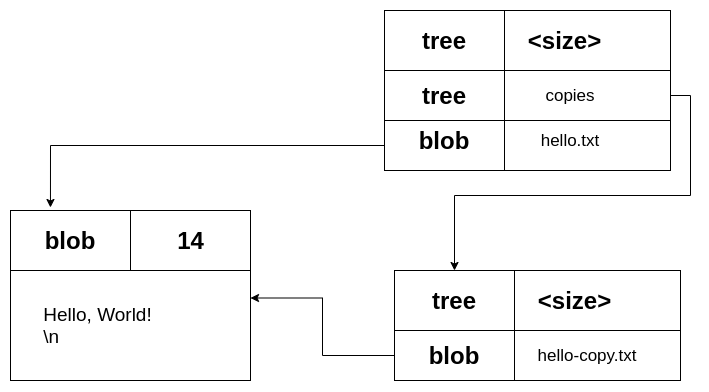
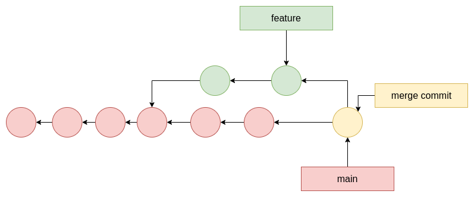
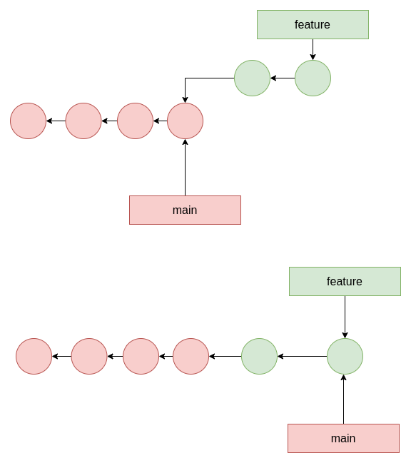
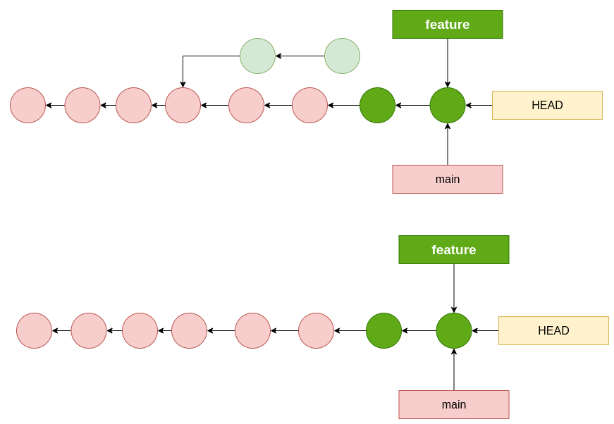

---

title: Advanced Git Workshop
author: Smarak Das
date: 2021-02-20
extensions:
 - image_ueberzug

---

# INTRO

What is git?

Kind of like a key value store where the value is the data and the key is the
hash of data. 

Key -> SHA1
40 digit hexadecimal number

Given the same input -> SHA1 will be the same.

---

# BLOBS AND TREES

## BLOBS
Git stores compressed data in a blob

  - **the identifier blob**
  - **the size of the content**
  - **\0 delimiter**
  - **content**

 +------+-------------+
 |      |             |
 | blob | 14          |
 |      |             |
 +------+-------------+
 |                    |
 | \0                 |
 | Hello World!       |
 |                    |
 +--------------------+
 

```bash
  echo "Hello, World!" | git hash-object --stdin
```
Prints 8ab686...

Now let's add the metadata that git stores and try to use SHA1 on it.
```bash
  echo 'blob 14\0Hello, World!' | openssl sha1
```
Prints the same hash.

Now let's run the hash-object command again. But this time with -w as well.

## TREES
A tree contains pointers (using SHA1):
 - to blobs
 - to other trees

and metadata:
 - type of pointer (blob or tree)
 - filename or directory name
 - mode (executable file, symbolic link, ...)
  
  
Think of this directory tree:

  ./copies/hello-copy.txt
  ./hello.txt
  
  Both of the files contain the same line:
  'Hello, World!'
  
  
  
  
  
  
  
  
  
 

---

# COMMITS
Commits in git are pointers to a tree.

And they contain the following metadata:
 - author & commiter
 - date
 - message
 - parent commit

The SHA1 of a commit is the hash of all of this information.


A commit is the snapshot of the code at the point of time when the commit was
made.

```bash
  # prints the type.
  git cat-file -t <sha1> 
  # prints the content.
  git cat-file -p <sha1>
```

**You can never change a commit, once it has been made.**

---

# COMMIT MESSAGES AND DESCRIPTION

All of us know this:
```bash
  git commit -m "Commit message"
```

But we can do better.

Just run this:
```bash
  git commit
```

This will open an editor instead of committing directly.
You can set your preferred editor using (You totally should do this):
```bash
  git config --global core.editor <editor>
```

---
# STASH

Let's go over the following commands:

```bash
  # stashes your work.
  git stash
```

```bash
  # stashes your work, including the untracked files.
  git stash -u
```

```bash
  # lists the stashed work.
  git stash list
```

```bash
  # clears the stash
  git stash clear
```

```bash
  # removes and applies the topmost entry in the stash to the current working
  # area.
  git stash pop
```

```bash
  # applies the stashed work that you specify.
  git stash apply stash@{0}
```
---
# MERGING AND REBASING

## Merge:
The default way to integrate changes from a different branch to the current.
 
 
 


---
# Fast Forward
Fast Forward: This happens when there are no commits on the base branch that 
occured after the feature branch was created.
 
 
 


If you want to avoid fast forward -> Then you can use the --no-ff flag.

```bash
  git checkout main
  git merge feature --no-ff
```

This will force a merge commit, even when it isn't necesaary.

---
  
## Rebase:

Rebase essentially means -> give a commit a new parent.
i.e. a new base commit.

 

---

# Amend

This will let you amend the commit message.
```
  git commit --amend
```

You can also add a file you forgot to the previous commit.
```
  git add new-file
  git commit --amend
```


